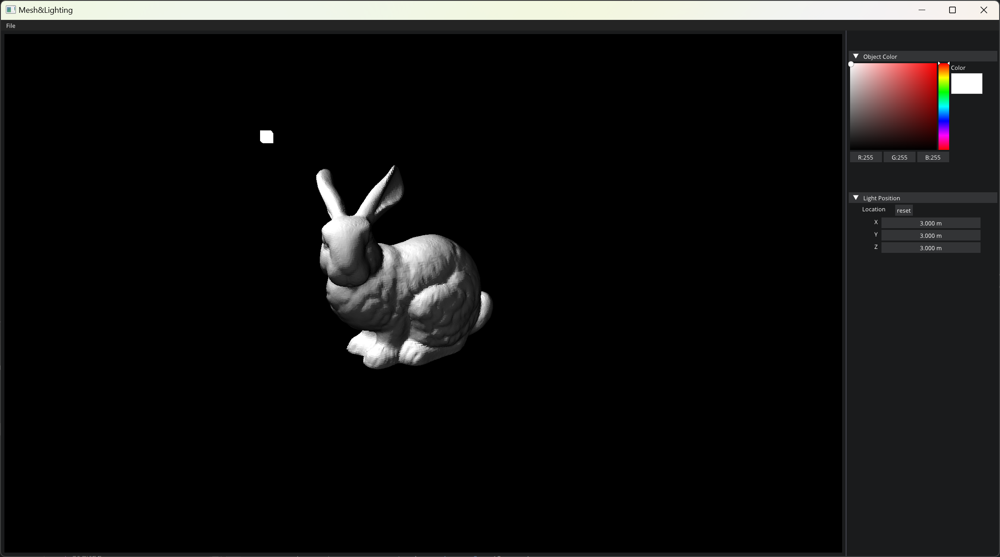

# Mesh Lighting

メッシュとライティングの3Dアプリ

This is an application created base on the framework of "[Hazel Engin](https://github.com/TheCherno/Hazel)
".

This application uses **ImGui** for UI and **OpenGL** for Rendering. 

- Diffusion Lighting 
- OBJ Files Drop Reading

## Getting Started
### Windows & Visual Studio
Run "genProject.bat" to generate visual studio 2022 solution.  
If you use other visual studio version, just modify "vs2022" in "genProject.bat".
